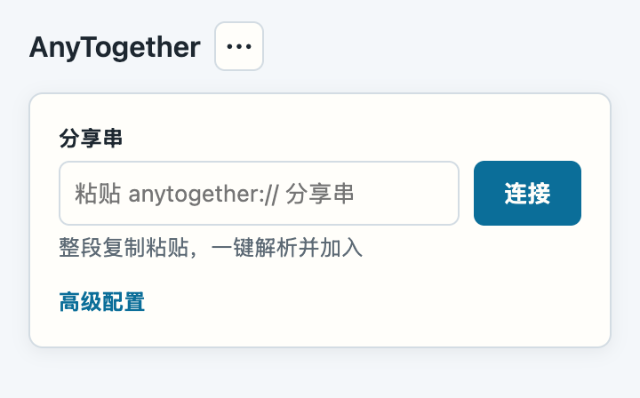
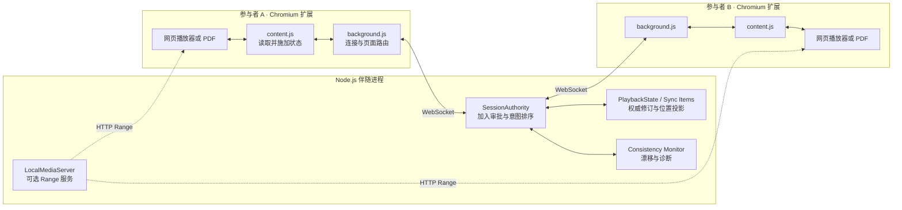

# AnyTogether

> 两个人，一个权威状态。用浏览器原生控件同步网页视频、本地视频与 arXiv PDF。

<p>
  
  
  
  
  
</p>

AnyTogether 是一个面向熟人多人场景的自托管同步工具。Node.js 伴随进程维护唯一权威状态，Manifest V3 扩展识别当前资源、转发原生操作，再把权威状态施加回页面。参与者地位相同：任一方都能控制播放、调整进度或切换资源；先加入者成为 host，负责审批后续加入请求。

项目以局域网为主要使用环境。CLI 也能部署在公网服务器，但 AnyTogether 不提供 TLS、账号、云中继或内置认证；异地组网和传输加密需要由使用者通过可信 VPN、隧道或其他网络层解决。

> [!IMPORTANT]
> 当前代码按生产标准演进，但首个 GitHub Release 尚未发布。维护者本地的 257 项自动化测试已全部通过；`tests/` 不随公开仓库分发。维护者已实际验证网页视频双端同步、arXiv PDF、断线与页面切换恢复、公网服务器连接；本地视频的真实双设备验收仍是 TODO。

<p align="center">
  
</p>

**快速导航：** [快速开始](#快速开始) · [支持范围](#支持范围) · [共享本地视频](#共享本地视频) · [网络边界](#网络边界) · [工作原理](#工作原理) · [生产就绪清单](#生产就绪清单)

## 能做什么

- **同步原生操作**：直接使用网站播放器完成播放、暂停、拖动、倍速和重播，不再维护一套重复控制条。
- **参与者平权**：任一参与者都可以提交播放意图和切换当前资源。
- **权威排序**：服务端按到达顺序裁决意图，用单调 revision 和 sequence 阻止旧状态覆盖新状态。
- **持续校准**：各端回报页面真实状态；持续漂移、资源不一致和执行失败会进入诊断与受控重同步。
- **安全切换资源**：切换期间等待全体参与者确认新资源，并吸收旧页面仍在途的回声。
- **局域网共享单个文件**：本地视频通过带随机令牌的 HTTP Range 服务传输，不上传到第三方。
- **同步 PDF 标量状态**：arXiv PDF 可以同步归一化滚动位置与缩放比例。
- **按站点隔离适配**：站点身份和媒体控制位于同步器层，不侵入会话排序与一致性核心。

## 支持范围

### 资源

| 资源 | 同步内容 | 支持等级 | 验证口径 |
|---|---|---|---|
| Bilibili 视频页 | 播放、暂停、进度、倍速、结束与错误状态 | 正式支持 | 维护者已完成网页视频双端实测；适配器与集成测试已覆盖 |
| YouTube `/watch?v=…` | 播放、暂停、进度、倍速、结束与错误状态 | 正式支持 | 维护者已完成网页视频双端实测；适配器与集成测试已覆盖 |
| MissAV `missav.live` | 标准 HTMLMediaElement 播放状态 | 实验支持 | 适配器与自动化测试已实现，站点变化可能破坏兼容性 |
| Pornhub `view_video.php` | 标准 HTMLMediaElement 播放状态 | 实验支持 | 适配器与自动化测试已实现，站点变化可能破坏兼容性 |
| XVideos `video.*` | 标准 HTMLMediaElement 播放状态 | 实验支持 | 适配器与自动化测试已实现，站点变化可能破坏兼容性 |
| 本地视频 | 播放、暂停、进度、倍速、HTTP Range 拖动 | 待实机验收 | 服务端、动态权限和自动化测试已实现；真实双设备验收未完成 |
| arXiv PDF | 滚动位置、缩放比例 | 实验支持 | 维护者已实测符合预期；不同 Chromium PDF viewer 仍可能限制脚本注入 |

正式支持站点是 Bilibili 和 YouTube。MissAV、Pornhub、XVideos 与 arXiv PDF 保留实验标记，不承诺第三方页面改版后仍然立即可用。

普通网页、DRM、跨源 iframe、WebAudio、canvas 视频和站点专有状态不在当前范围。AnyTogether 不同步清晰度、字幕、音轨、弹幕或播放列表。

### 浏览器

正式目标是 Chromium 家族：

- Google Chrome
- Chromium
- Brave

扩展使用 Manifest V3。三种浏览器仍需要形成逐项发布验收记录；“正式目标”不等于当前已经完成所有操作系统和版本组合的实测矩阵。

## 快速开始

AnyTogether 在架构上分为两端：

- **服务端**：Node.js 伴随进程（CLI）。它是唯一的权威状态机，负责裁决播放意图、资源切换和一致性校验。部署在其中一位参与者的电脑或服务器上。
- **客户端**：浏览器扩展。每位参与者在自己的 Chrome 中加载扩展，由它识别页面、转发原生播放操作、把权威状态施加回页面。

所有客户端必须能通过网络访问服务端：局域网直接互通；公网部署时在服务端防火墙放行 WebSocket 端口。

### 服务端：安装与运行

要求 Node.js 22 或更高版本与 npm（可选的 `curl` 只用于探测公网出口 IPv4）：

```console
$ git clone https://github.com/zeroffa233/any-together.git
$ cd any-together
$ npm run setup
$ npm run doctor
```

`npm run setup` 安装缺失依赖、编译 TypeScript、创建本地配置并准备扩展目录；`npm run doctor` 检查 Node 版本、依赖、配置和扩展文件。

启动会话，macOS / Linux 可以使用交互式启动器：

```console
$ ./any-together.sh --port 8765 --name movie-night
```

跨平台启动方式：

```console
$ npm run start -- --port 8765 --name movie-night
```

也可以把运行参数写进当前目录唯一的 `.yml` 文件：

```console
$ cp config/any-together.example.yml any-together.yml
$ ./any-together.sh
```

每个字段都按“命令行参数 > `.yml` > 内置默认值”解析。当前目录出现多个 `.yml` 时程序会拒绝猜测；使用 `--config <path.yml>` 明确选择，或通过 npm 包装器传入 `--host-config <path.yml>`。

会话 ID 默认使用随机 UUID。`--name` 是不含空白的易读别名。CLI 启动后会打印完整分享串，把它发给所有参与者：

```text
anytogether://session?host=<host>&port=<port>&session=<session-id>
```

### 客户端：安装扩展

扩展不上架应用商店，需要在 Chrome 中以“加载已解压的扩展程序”方式导入。扩展目录是仓库中的 `extension/`；客户端设备不需要安装 Node，也不需要克隆整个仓库——把 `extension/` 目录复制到客户端设备即可，host 可以把这个目录打包发给其他参与者。

在 Chrome 中导入扩展：

1. 打开扩展管理页 `chrome://extensions`。
2. 打开右上角的“开发者模式”开关。
3. 点击“加载已解压的扩展程序”，选择 `extension/` 目录。
4. 在扩展列表中确认 AnyTogether 已启用，建议固定到工具栏。

Chromium 和 Brave 的步骤相同。扩展代码更新后，回到 `chrome://extensions` 点击“重新加载”。

### 连接参与者

1. 每位参与者打开受支持的资源页。
2. 打开扩展，把 CLI 打印的完整分享串粘贴到输入框，然后连接。
3. host 在弹窗中逐个审批其他参与者的加入请求。
4. 等待弹窗显示“已就绪”，然后直接操作页面原生播放器。

分享串已经包含地址、端口和 Session ID。没有分享串时，可以展开“高级配置”，手动填写地址、端口以及 Session ID 或会话名称。


## 共享本地视频

使用绝对路径共享单个本地文件：

```console
$ npm run start -- --port 8765 --name movie-night --share "/absolute/path/to/movie.mp4"
```

指定媒体端口；`0` 表示使用系统分配的临时端口：

```console
$ npm run start -- --port 8765 --share "/absolute/path/to/movie.mp4" --media-port 0
```

未指定 `--media-port` 时，媒体端口默认为 WebSocket 端口加 2，即默认 `8767`。扩展第一次打开该资源时，只申请当前 `http://<host>:<media-port>/*` 的访问权限。

本地视频服务遵守以下边界：

- 一次只共享一个普通文件；
- 每次启动生成新的随机令牌；
- 停止服务后令牌失效；
- 支持 GET、HEAD、单区间 Range 和 `If-Range`；
- 文件按流读取，不整体载入内存；
- 不上传、不转码、不浏览目录；
- 两端浏览器必须支持相同的容器和编解码器。

实现和安全模型见 [`docs/local-video-broadcast.md`](docs/local-video-broadcast.md)。

> [!WARNING]
> 本地视频当前只有代码、自动化测试和协议验证，尚缺真实双设备局域网验收。不要把它描述成已经完成完整实机兼容性验证的正式能力。

## 网络边界

会话 WebSocket 默认监听 `0.0.0.0:8765`。CLI 会枚举局域网 IPv4，并在存在 `curl` 时尝试通过 `ifconfig.me` 获取公网出口 IPv4。

AnyTogether 当前使用明文 `ws://`，不提供：

- TLS 证书管理；
- 账号或访问令牌认证；
- 云端转发；
- 端到端加密；
- 公网抗滥用保护。

公网服务器连接已经过维护者实际验证，但传输加密和网络准入不属于 AnyTogether 当前实现。跨网络使用时，应由使用者建立可信 VPN、隧道或等价的安全网络层。家庭网络还需要自行处理端口转发与防火墙。

使用本地视频时还要开放媒体端口。会话信息 API 默认只监听 `127.0.0.1`，不会暴露到局域网。

## 工作原理



资源切换和播放同步遵守七条规则：

1. 页面原生事件只产生意图，不能直接覆盖对端状态。
2. 服务端按到达顺序裁决意图，并递增 `stateRevision` 和 sequence。
3. 两端只执行更新修订，并通过 `ResourceIdentity` 拒绝错误资源上的命令。
4. 每条连接在加入前独立校准 VPS 与浏览器的时钟偏移，禁止跨设备直接相减绝对时间戳。
5. 播放状态只在同一时钟域内按时间锚点投影；暂停、缓冲、跳转、结束和错误使用明确相位。
6. 超过 250 ms 的可修复偏差需要连续三次报告才触发强制重同步，并受两秒冷却限制。
7. 资源切换等待全体参与者确认新身份或五秒超时，确认后再保留短暂宽限以吸收旧页面回声。

线上消息和状态约束见 [`docs/syncers/protocol.md`](docs/syncers/protocol.md)。

## 配置

主机运行配置使用当前目录唯一的 `.yml` 文件。根目录 `.yml` 已被 `.gitignore` 忽略；可复制 [`config/any-together.example.yml`](config/any-together.example.yml) 开始配置。相对 `share` 路径以 YAML 文件所在目录为基准。

```yaml
port: 8765
name: movie-night
autoAccept: false
# sessionId: fixed-session-id
# resource: https://www.bilibili.com/video/BV...
# share: ./movie.mp4
# mediaPort: 8767
```

| YAML 字段 | 默认值 | 说明 |
|---|---:|---|
| `port` | `8765` | WebSocket 端口；`0` 表示临时端口 |
| `name` | 未设置 | 不含空白的会话别名 |
| `sessionId` | 随机 UUID | 可选固定 Session ID |
| `autoAccept` | `false` | 自动接受加入请求，只建议自动冒烟使用 |
| `resource` | 未设置 | 可选初始受支持资源 URL，与 `share` 互斥 |
| `share` | 未设置 | 可选本地视频路径，与 `resource` 互斥 |
| `mediaPort` | `port + 2` | 本地视频端口；要求同时设置 `share`，`0` 表示临时端口 |

命令行支持同名参数：`--port`、`--name`、`--session-id`、`--auto-accept`、`--no-auto-accept`、`--resource`、`--share` 和 `--media-port`。未知 YAML 字段、错误类型、多个 `.yml`、`resource`/`share` 同时存在都会在启动前报错。

[`any-together.config.json`](config/any-together.config.example.json) 只保存扩展安装工具设置，使用 [`config/any-together.config.schema.json`](config/any-together.config.schema.json) 校验；它不再承载主机运行参数。

常用命令：

| 命令 | 用途 |
|---|---|
| `npm run setup` | 安装依赖、构建、创建配置并准备扩展 |
| `npm run doctor` | 检查环境、配置和扩展文件 |
| `npm run config` | 创建或验证本地扩展工具配置 |
| `npm run extension:prepare` | 准备可加载的扩展目录 |
| `npm run extension:install` | 准备扩展并启动独立浏览器配置 |
| `npm run start` | 读取当前目录 `.yml` 并启动伴随进程，可在 `--` 后覆盖参数 |
| `npm run smoke:lan` | 运行同进程双客户端 WebSocket 冒烟 |
| `npm run smoke:process` | 运行独立 host/client 进程冒烟 |

查看外围工具参数：

```console
$ node scripts/any-together.mjs --help
```

## 开发

```console
$ npm install
$ npm run build
$ npm run smoke:lan
$ npm run smoke:process
$ node --check extension/background.js
$ node --check extension/content.js
$ node --check extension/identity.js
$ node --check extension/popup.js
```

维护者的自动化测试位于本地且被 `tests/` 忽略，不随公开仓库分发。公开仓库可直接执行构建、两个 smoke 和扩展脚本语法检查。

新增 HTMLMediaElement 站点时，需要同步维护 Node 适配器、`extension/identity.js`、Manifest URL 作用域和对应测试。不要在 `content.js` 或 `background.js` 中重复站点域名规则。

进一步阅读：

- [同步器架构](docs/syncers/overview.md)
- [线上协议与状态语义](docs/syncers/protocol.md)
- [同步器编写指南](docs/syncers/authoring.md)
- [UI 交互设计](docs/ui-interaction-design.md)
- [资源路线图](docs/roadmap.md)

## 生产就绪清单

首个计划版本是 `v0.1.0`，发布形式为 GitHub 源码包和可解压加载的扩展 ZIP。当前尚无 Git 标签，也没有正式 GitHub Release。

发布前阻断项：

- [ ] 删除仓库中的 `omp-session-*.html` 会话产物；
- [ ] 停止跟踪根目录 `any-together.config.json`，只保留 schema 和 example；
- [ ] 统一 README、路线图、同步器文档和扩展注释中的当前能力口径；
- [ ] 设计“双节点连接”Logo，并补齐浅色、深色和扩展图标资源；
- [ ] 实现用户主动触发的诊断包导出；
- [ ] 诊断包保留 adapterId 和公共站点域名，但移除 IP、Session ID、参与者 ID、完整 URL、本地路径和本地视频令牌；
- [ ] 新增 `CHANGELOG.md`、`CONTRIBUTING.md`、`SECURITY.md`、Issue 模板和 PR 模板；
- [ ] 新增本地发布检查清单和扩展 ZIP 打包命令；
- [ ] 生成并检查 `any-together-v0.1.0-extension.zip`；
- [ ] 在 GitHub 中启用 Private Vulnerability Reporting；
- [ ] 完成本地发布验证后创建 `v0.1.0` 标签与 Release。

首发后质量项：

- [ ] 完成本地视频双设备实机验收；
- [ ] 为 Chrome、Chromium、Brave 分别形成发布验收记录；
- [ ] 补充 Windows、Linux、防火墙、弱网和长时间播放验证；
- [ ] 评估 GitHub Actions；当前不设置 CI，也不显示 CI 徽章；
- [ ] 评估标准 WSS 或反向代理接入方式。

明确不在首版范围：多资源会话、账号、聊天、云中继、内置 TLS、独立桌面应用、平台独立二进制、Docker 镜像和浏览器商店发布。

## 反馈与安全

普通缺陷和功能请求通过 GitHub Issues 记录。首个 Release 前会补充 Issue 模板、`SECURITY.md`，并启用 GitHub Private Vulnerability Reporting；在该私密安全渠道启用前，不要通过公开 Issue 披露未修复漏洞。

AnyTogether 默认不上传遥测。计划中的诊断导出由用户主动触发，只在本地生成经过脱敏的 JSON 文件。

## License

仓库当前没有 `LICENSE`，维护者选择暂不授予许可证。公开源码和 GitHub Release 不代表获得复制、修改、分发或商业使用授权。
