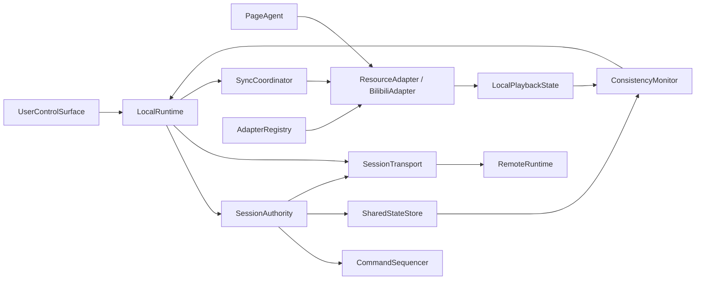

# AnyTogether 首版需求规格

## 0. 文档目的

本文档是 AnyTogether 首版的开发基线。目标不是描述某个具体技术栈，而是把首版必须实现的用户行为、同步语义、对象职责、模块边界、失败条件和验收方式定义到开发者可以直接拆分任务的程度。

本文档只覆盖首版核心场景：两个人在同一局域网内，通过已知 IP 加入同一会话，共同观看 Bilibili 视频。非核心扩展能力保持最简；同步正确性和未来可扩展的边界不能简化。

旧设计文档 `docs/old_designs/1.md`、`docs/old_designs/2.md` 只用于反推需求边界，不作为技术路线依据。

## 1. 产品定义

### 1.1 产品目标

AnyTogether 让两名用户在不搬运网页资源的前提下，共同观看同一个 Bilibili 视频，并让两端的共享播放状态和播放进度持续收敛。

首版首先证明三件事：

1. 两个浏览器页面可以加入同一个局域网会话。
2. Bilibili 视频的核心播放操作可以被抽象成可复用的共享语义。
3. 两端能够在操作后收敛到唯一的共享状态，并在无法收敛时明确报告失败。

### 1.2 产品原则

- **资源不搬运**：AnyTogether 同步控制意图和共享状态，不把 Bilibili 视频内容转发给另一端。
- **同步核心优先**：播放状态、播放位置、命令顺序和一致性诊断是首版核心。
- **适配器隔离站点差异**：Bilibili 页面结构、播放器选择、原生事件和站点特色能力不进入同步核心。
- **先可证明，再扩展**：首版先实现可验证的单资源同步，再扩展音乐、网页滚动、电子书等资源。
- **显式失败**：一端无法执行权威状态时必须进入可见的不同步/失败状态，不得静默继续。
- **局域网优先**：首版只要求局域网内已知 IP 连接；NAT 穿透、信令、中继和账号体系不属于首版。

## 2. 首版范围

### 2.1 In Scope

- 创建局域网会话。
- 通过已知 IP 加入局域网会话。
- 两名用户参与同一会话。
- 创建者提供或确认 Bilibili 视频资源。
- 加入者打开同一视频资源。
- 检查两端资源身份是否一致。
- 同步播放、暂停、跳转、拖动进度、播放速度、播放结束和恢复播放。
- 同步加载、就绪、播放、暂停、跳转中、缓冲、结束和错误等播放状态。
- 对两端操作进行明确顺序裁决。
- 广播唯一的权威共享状态。
- 在两端之间进行播放位置收敛和漂移修正。
- 检测资源不一致、适配器执行失败、消息丢失/过期和持续漂移。
- 为未来资源适配器保留稳定的语义接口边界。
- 使用浏览器授权页面脚本控制 Bilibili 页面中的视频资源。

### 2.2 Out of Scope for MVP

- 异地直连、NAT 穿透、公共信令服务器和中继服务。
- 账号系统、云端用户资料和社交关系。
- 自动发现局域网设备；首版使用已知 IP。
- 多于两名用户的完整产品化支持。
- 本地文件播放流程。统一资源模型可以为后续本地文件服务预留，但不作为首版验收项。
- 音乐、网页滚动、电子书、PPT、直播时移等非视频资源。
- 多个独立视频同时作为共享资源的产品化流程；适配器可以保留选择策略接口，但首版验收只要求一个目标视频。
- 完整权限管理、复杂主持人转移和冲突合并算法。
- 音量、静音、全屏、清晰度、字幕、弹幕等设备或站点体验的跨端一致性。
- Bilibili 内容代理、下载、转码或资源重新分发。
- 对抗所有站点防御机制；首版只验证目标 Bilibili 场景。

## 3. 术语表

| 术语 | 定义 |
|---|---|
| 会话 Session | 两名用户及其共享资源、权威状态和有序操作序列的运行边界。 |
| 创建者 Host | 创建会话并拥有会话权威状态的用户。首版默认由创建者承担顺序裁决职责。 |
| 加入者 Client | 通过已知 IP 加入既有会话的用户。 |
| 共享资源 Shared Resource | 会话要求所有端加载的同一个 Bilibili 视频。 |
| 资源身份 Resource Identity | 能判断两端是否打开同一资源的规范化标识。至少包含规范化 URL 和站点适配器标识；若可获得，还应包含视频 ID。 |
| 适配器 Resource Adapter | 把某类网页资源映射为 AnyTogether 语义的页面侧模块。它负责资源发现、目标对象选择、状态读取、动作执行和原生事件监听。 |
| 播放游标 Playhead | 视频在媒体时间轴上的位置，单位为秒；播放状态为播放时它会随时间推进。 |
| 共享播放状态 Shared Playback State | 会话必须收敛的资源身份、媒体状态、游标、播放速度和状态版本。 |
| 播放意图 Playback Intent | 用户或页面事件希望对共享资源执行的语义操作，例如 Play、Pause、Seek 或 SetRate。 |
| 权威状态 Authoritative State | 由会话权威源按顺序裁决后产生的唯一共享状态。 |
| 状态版本 Revision | 权威状态的单调递增版本号。每次接受会改变共享状态的操作至少递增一次。 |
| 操作序号 Sequence | 权威源为接受的操作分配的单调递增序号，用于定义顺序、去重和诊断。 |
| 漂移 Drift | 某端实际播放游标与权威状态在同一参考时刻的差值。 |
| 收敛 Convergence | 某端从收到权威状态到进入允许误差范围并保持的过程。 |
| 站点扩展 Site Extension | 不改变核心播放同步语义的站点特色操作，例如弹幕开关。 |

## 4. 参与者与权限

### 4.1 用户

- **创建者**：创建会话、提供会话连接信息、确认共享资源、作为首版默认权威状态源。
- **加入者**：输入创建者 IP 加入会话、加载共享资源、执行允许的播放操作。

首版不要求复杂权限模型。两名用户都可以产生播放意图；谁先被权威源接受，谁的操作先进入有序序列。后续可以增加“仅主持人可控制”等权限，但不能改变核心状态模型。

### 4.2 浏览器页面

浏览器页面承载 Bilibili 视频。页面侧运行 AnyTogether 页面代理和 Bilibili 适配器，负责把页面原生行为转换为播放意图，并执行权威播放状态。

### 4.3 信任边界

首版采用“已知局域网 IP + 用户主动加入”的信任模型。不提供账号认证或公网安全模型。实现必须避免默认监听公网接口；具体绑定策略属于实现安全约束，不能绕过用户主动创建会话的边界。

## 5. 核心用户旅程

### UJ-1 两名用户共同观看 Bilibili 视频

- **参与者与上下文**：用户 A 和用户 B 在同一局域网内；A 知道自己的本机地址，B 知道 A 的地址。
- **进入状态**：两人已经安装并启用浏览器集成；A 打开 Bilibili 视频页面，B 可以打开同一页面或等待会话提供资源信息。
- **路径**：
  1. A 创建会话，系统生成会话连接信息并显示可连接地址。
  2. B 输入 A 的 IP，发起加入；A 接受或拒绝该加入请求。
  3. A 确认当前 Bilibili 视频为共享资源；系统向 B 提供规范化资源身份。
  4. 两端加载并报告资源身份和页面适配状态；资源身份不一致时不得进入同步就绪态。
  5. 任一用户执行播放、暂停、拖动、跳转、速度变更或重新播放；该操作被转换成播放意图，按权威顺序裁决后广播唯一状态。
  6. 两端分别由 Bilibili 适配器执行权威状态，并持续报告实际状态和漂移。
  7. 两端在允许的收敛时间内进入一致状态；观看过程中持续监测漂移。
- **价值交付**：两名用户看到同一视频，并且播放/暂停、位置和速度在操作后收敛；任何无法收敛的情况都被明确显示。
- **失败路径**：资源身份不一致、任一端没有可控制的视频、权威命令无法执行、消息序列断裂、或持续漂移超过阈值时，会话进入不同步状态并要求重新同步或结束会话。

## 6. 首版共享状态模型

### 6.1 共享状态字段

```text
AuthoritativePlaybackState
  sessionId
  resourceIdentity
  stateRevision
  lastSequence
  mediaPhase          // loading | ready | playing | paused | seeking | buffering | ended | error
  positionSeconds     // 参考时刻下的媒体位置
  positionAtMs        // positionSeconds 对应的权威时间
  playbackRate
  durationSeconds     // 可选；双方可获得时必须校验是否一致
  lastCommandId
  updatedAtMs
  errorCode            // mediaPhase=error 时必填
```

`positionSeconds` 和 `positionAtMs` 必须成对出现。接收端不能把一个过期的固定位置直接当成当前播放位置；当 `mediaPhase=playing` 时，应根据 `playbackRate` 和参考时间推算当前目标位置。

### 6.2 状态生命周期

```text
loading -> ready -> paused
                   -> playing -> paused
                   -> seeking -> playing | paused
                   -> buffering -> playing | paused
                   -> ended -> playing
任何正常状态 -> error
error -> loading（重新加载或重新绑定资源）
```

适配器可以报告站点特有的中间状态，但核心必须能够映射到上述状态。`buffering` 不等同于用户主动 `paused`；两端必须保留这一区别。

### 6.3 共享操作

| 操作 | 共享 | 首版要求 |
|---|---:|---|
| Load/Bind Resource | 是 | 校验两端是否同一 Bilibili 视频。 |
| Play | 是 | 权威状态进入 `playing`；执行失败必须报告。 |
| Pause | 是 | 权威状态进入 `paused`。 |
| Seek | 是 | 支持时间轴点击、拖动完成、快进和快退造成的跳转。 |
| Set Playback Rate | 是 | 速度值进入权威状态并在两端执行。 |
| Replay / Play After End | 是 | `ended` 后重新播放必须重新进入有序状态。 |
| Buffering / Waiting | 是 | 作为状态反馈参与恢复和诊断，不被误判为用户暂停。 |
| Media Error | 是 | 进入显式错误状态，不能继续宣称同步成功。 |
| Volume / Mute | 否 | 首版保留本地偏好。 |
| Fullscreen | 否 | 首版本地控制。 |
| Quality | 否 | 首版本地控制，避免设备带宽差异破坏播放。 |
| Subtitle / Danmaku | 否 | 首版不纳入核心一致性；未来作为站点扩展能力。 |

## 7. 顺序裁决与一致性规则

### 7.1 默认权威模型

首版采用创建者权威、操作有序、最终状态唯一的模型：

1. 创建者运行会话权威状态源。
2. 两端都可以提交播放意图。
3. 权威源为每个接受的意图分配单调递增 `sequence` 和 `stateRevision`。
4. 权威源按接受顺序处理意图，并从当前权威状态计算下一个状态。
5. 权威源广播带有 `sequence`、`stateRevision` 和 `lastCommandId` 的状态。
6. 两端只把最新合法版本作为最终共享状态；重复、过期或版本倒退的消息不得覆盖新状态。

“同时操作”定义为在权威源尚未处理上一条操作前抵达的多个意图。最终顺序由权威源的接收顺序决定；同一接收批次必须使用确定性的连接顺序和本地序号作为 tie-breaker，不能使用未定义的随机顺序。

### 7.2 操作语义

- `Play`：目标状态为 `playing`，位置为当前权威位置。
- `Pause`：目标状态为 `paused`，位置固化为权威参考时刻的媒体位置。
- `Seek(target)`：目标位置为 `target`；该命令覆盖此前未执行的本地拖动预览。
- `SetRate(rate)`：更新权威速度；如果当前为播放，目标位置根据新速度继续推算。
- `Replay`：目标位置为零或站点允许的起始位置，目标状态为 `playing`；具体边界由适配器报告。
- `Load/Bind`：只有资源身份校验通过且适配器已就绪，才能进入播放同步态。

### 7.3 幂等、顺序和恢复

- 每个命令有唯一 `commandId`；同一命令重复到达不得重复执行。
- 每个状态有 `stateRevision`；低于当前版本的状态不得覆盖本地最新状态。
- 客户端发现版本间隙时必须请求完整快照，而不是自行猜测缺失操作。
- 快照恢复后，客户端重新报告实际媒体状态；权威源再决定是否发送校正命令。
- 权威源重启造成会话状态丢失时，首版允许会话结束并重新创建，不要求持久化恢复。

### 7.4 位置收敛与漂移

首版采用以下初始验收目标。它们是工程基线，不是“任意时刻浮点数完全相等”的要求：

- 在正常局域网、两端都已就绪且没有缓冲时，收到播放/暂停/跳转/速度命令后，两端必须在 **1 秒内**进入同一共享状态。
- 播放状态为 `playing` 时，连续 60 秒采样中，两端实际位置与权威目标位置的绝对差值必须保持在 **250 ms** 以内；超出后必须触发校正或不同步告警。
- `paused`、`ended`、`error` 等离散状态必须完全一致；不得用位置接近掩盖状态不一致。
- 任一端处于缓冲时，可以暂时不满足位置阈值，但必须报告 `buffering`；恢复 `playing` 后必须重新收敛。
- 位置校正不得无限循环。连续校正仍失败时，`ConsistencyMonitor` 必须把会话标记为不同步。

上述阈值若在真实原型测试中不适合，可在后续需求修订中调整；在没有测量证据前不能删除收敛时限、漂移阈值和失败出口。

## 8. 功能需求

### F1. 会话创建与加入

#### FR-001 创建会话

创建者可以创建一个空闲会话，并获得供加入者使用的局域网连接信息。

**验收条件：**

- 创建成功后产生唯一 `sessionId`。
- 会话显示可连接的本机地址或地址输入信息。
- 创建者在未绑定共享资源前不能宣称会话已就绪。
- 创建失败时显示明确原因，不产生半有效会话。

#### FR-002 通过已知 IP 加入

加入者可以输入创建者 IP 发起加入请求。

**验收条件：**

- 正确 IP 的加入请求到达创建者。
- 创建者可以接受或拒绝请求。
- 错误 IP、不可达地址或拒绝请求必须显示明确失败状态。
- 首版不要求局域网自动发现。

#### FR-003 限制首版参与人数

首版会话只保证两名用户的行为。

**验收条件：**

- 创建者和一名加入者可以进入同步态。
- 第三名用户加入时必须被拒绝或明确提示不受首版支持；不得静默进入未定义状态。

### F2. 共享资源绑定

#### FR-004 确认共享 Bilibili 资源

创建者可以把当前 Bilibili 视频设为会话共享资源。

**验收条件：**

- 共享资源包含规范化 URL、域名和适配器标识。
- 若页面能够提供视频 ID，则资源身份包含视频 ID。
- 非 Bilibili 页面不能被误报为首版支持资源。

#### FR-005 验证资源身份

会话在进入同步就绪态前必须验证两端加载的是同一个共享资源。

**验收条件：**

- 两端资源身份完全匹配时进入 `ready`。
- URL、视频 ID 或适配器标识冲突时拒绝进入同步态，并显示资源不一致。
- 资源身份未知时进入 `unverified`/错误路径，不得默认视为一致。

#### FR-006 选择目标视频

Bilibili 适配器必须提供明确的目标视频选择策略。

**验收条件：**

- 页面只有一个目标视频时能够绑定。
- 页面存在多个视频对象时，适配器必须根据声明的选择策略选择目标，不能由核心同步层直接取第一个对象。
- 找不到目标或选择结果不稳定时返回适配失败。

### F3. 播放控制与状态同步

#### FR-007 同步播放与暂停

任一用户执行播放或暂停后，两端都执行权威结果。

**验收条件：**

- 播放命令产生唯一序号和状态版本。
- 暂停命令固化权威位置。
- 两端在 1 秒内进入相同的播放/暂停状态。
- 任一端执行失败会被报告为不同步，而不是被忽略。

#### FR-008 同步跳转和拖动

任一用户通过时间轴跳转、拖动完成、快进或快退后，两端都跳转到同一目标位置。

**验收条件：**

- 连续拖动过程不会产生无限数量的共享命令；实现可以只提交拖动结束值，但必须保持最终语义一致。
- 每个有效跳转都有唯一 `commandId`。
- 目标位置在 1 秒内收敛到允许误差范围。
- 过期跳转不得覆盖后来已裁决的状态。

#### FR-009 同步播放速度

任一用户改变播放速度后，两端都使用权威速度继续播放。

**验收条件：**

- 支持 Bilibili 页面允许的有效速度值。
- 非法或不支持的速度被拒绝并报告原因。
- 速度改变后两端的 `playbackRate` 相同。
- 播放中变速不得把位置重置到未定义值。

#### FR-010 同步结束和恢复

视频结束后，两端都进入 `ended`；任一用户重新播放时，两端都按有序命令恢复。

**验收条件：**

- `ended` 不是普通 `paused` 的别名。
- 一端先结束时，另一端收到权威结束状态或进入可诊断的等待状态。
- 重新播放后两端重新满足播放状态和位置收敛条件。

#### FR-011 区分缓冲和暂停

系统必须区分用户暂停与浏览器缓冲/等待。

**验收条件：**

- Bilibili 适配器能够把可识别的等待/播放恢复事件映射为 `buffering`/`playing`。
- 缓冲时不得广播一个虚假的用户暂停操作。
- 缓冲恢复后执行位置校正或报告失败。

#### FR-012 处理媒体错误

任一端无法加载、播放或控制媒体时，会话必须进入显式错误或不同步状态。

**验收条件：**

- 错误包含端点、资源身份、状态版本和可读错误类别。
- 错误状态不会继续显示“已同步”。
- 用户可以重新加载/重新绑定资源，或结束会话。

### F4. 有序裁决和状态恢复

#### FR-013 接受并排序播放意图

权威源必须接收两端播放意图并按确定顺序分配 `sequence`。

**验收条件：**

- 任意已接受命令都能根据 `commandId` 和 `sequence` 追踪。
- 同时到达的命令具有确定顺序。
- 状态版本不会倒退或重复覆盖。

#### FR-014 广播唯一权威状态

权威源必须向两端广播由当前命令序列产生的唯一共享状态。

**验收条件：**

- 两端对同一 `stateRevision` 得到相同的共享字段。
- 客户端不以本地事件直接覆盖权威状态。
- 本地事件只能形成新的播放意图或实际状态报告。

#### FR-015 处理丢失和重复消息

系统必须能够识别消息重复和状态版本间隙。

**验收条件：**

- 重复命令不重复执行。
- 发现版本间隙时请求快照。
- 快照恢复后能继续接受更高版本状态。
- 无法恢复时显式进入不同步状态。

#### FR-016 执行权威状态并报告结果

每个页面端必须执行权威共享状态，并报告执行后的实际状态。

**验收条件：**

- 页面端报告目标状态、实际状态、实际位置、适配器标识和状态版本。
- 执行成功和执行失败可区分。
- 页面端不能只回传“收到”，却不提供实际状态。

### F5. 一致性监测

#### FR-017 监测离散状态一致性

系统必须持续检查两端的 `mediaPhase`、资源身份、播放速度和状态版本。

**验收条件：**

- 任一离散共享字段不一致都会产生诊断事件。
- 诊断事件包含首次发现时间、两端实际值、权威值和状态版本。
- 未恢复前会话状态不是“同步成功”。

#### FR-018 监测播放位置漂移

系统必须在播放过程中监测实际位置与权威目标位置的漂移。

**验收条件：**

- 正常播放采样可以计算漂移。
- 漂移超过 250 ms 时触发校正或告警。
- 持续超过阈值且校正失败时进入不同步状态。
- 监测本身不得因为采样而产生无限控制命令。

#### FR-019 重新同步

用户可以对不同步会话发起重新同步。

**验收条件：**

- 重新同步使用当前权威状态快照，不使用任一端未经裁决的本地状态。
- 两端重新报告实际状态。
- 重新同步成功后恢复同步态；失败则保留明确失败原因。

### F6. 适配器扩展边界

#### FR-020 声明适配器能力

适配器必须声明其支持的资源匹配规则、资源选择策略、共享播放能力和可选站点扩展能力。

**验收条件：**

- 核心可以根据域名选择适配器。
- 一个适配器可以声明多个域名。
- 一个域名可以单独绑定一个明确适配器。
- 核心不会因为增加站点扩展能力而修改播放状态收敛算法。

#### FR-021 提供语义化适配器接口

适配器必须提供资源身份读取、目标对象选择、状态读取、状态执行、原生事件监听和错误报告能力。

**验收条件：**

- 接口描述的是播放语义，而不是只传递任意字符串动作。
- 站点专属动作可以作为扩展能力存在，但不能替代核心播放语义。
- 适配器执行失败可以被核心识别。

#### FR-022 保留未来资源类型边界

核心同步层必须不依赖 `HTMLVideoElement` 的具体 API；它依赖的是资源适配器提供的语义能力和状态模型。

**验收条件：**

- 未来资源可以使用不同的游标和状态执行方式，而不改变会话排序、版本和诊断逻辑。
- 适配器可以声明不支持某项能力。
- 不支持能力不会被伪装成支持；调用时返回明确的 unsupported 结果。

## 9. 非功能需求

### NFR-001 一致性可验证

共享离散状态必须完全一致；正常局域网且无缓冲时，播放位置必须满足 1 秒内收敛、连续 60 秒漂移不超过 250 ms 的首版基线。

### NFR-002 有序性

权威源分配的 `sequence` 和 `stateRevision` 单调递增；所有客户端拒绝版本倒退。

### NFR-003 可诊断性

每个状态变化和同步失败至少可以关联到 `sessionId`、`commandId` 或 `stateRevision`、端点和资源身份。

### NFR-004 可恢复性

可恢复的消息丢失、重复和短暂连接中断必须通过快照或重新同步恢复；不可恢复时必须显式失败。

### NFR-005 扩展隔离

增加新的资源适配器不能修改会话排序、状态版本和一致性监测的核心逻辑。

### NFR-006 资源不搬运

首版同步消息只包含资源身份、语义操作、共享状态和诊断信息，不包含 Bilibili 视频媒体数据。

### NFR-007 局域网约束

首版不依赖公网服务才能建立两端会话。异地场景必须通过外部虚拟局域网工具使双方表现为可达地址。

### NFR-008 失败可见

任何资源不一致、适配器不存在、执行失败、版本间隙无法恢复或持续漂移都必须显示为非成功状态。

### NFR-009 安全默认值

首版不应默认把会话服务暴露到不必要的公网接口；加入操作必须由用户主动发起，创建者至少能够拒绝未知加入请求。

### NFR-010 性能基线

首版不要求高并发，但在两名用户的局域网会话中，普通播放命令应在 1 秒内完成状态收敛；同步控制消息不得传输媒体内容。

## 10. 对象级架构

本节是需求级架构约束。它定义对象职责和协作，不强制语言、框架或目录名称。实现时每个对象必须能映射到明确模块；不允许通过一个“万能控制器”同时承担会话、协议、页面适配和一致性职责。

### 10.1 核心对象

| 对象 | 责任 | 不负责的内容 |
|---|---|---|
| `Session` | 保存会话生命周期、参与者、共享资源和当前同步状态；接收创建/加入/结束操作。 | 不读取 Bilibili DOM，不执行页面动作。 |
| `SessionAuthority` | 持有权威状态，接受播放意图，调用顺序器，发布唯一状态，处理快照恢复。 | 不决定页面中哪个视频对象是目标。 |
| `CommandSequencer` | 校验命令、去重、分配 `sequence` 和 `stateRevision`、定义同批次 tie-breaker。 | 不直接操作媒体。 |
| `SharedStateStore` | 保存和读取权威 `AuthoritativePlaybackState`；提供版本化快照。 | 不监听浏览器原生事件。 |
| `SyncCoordinator` | 把权威状态转为本端适配器执行计划，调度位置校正，汇报执行结果。 | 不定义站点选择器或站点命令。 |
| `ConsistencyMonitor` | 比较权威状态与端点实际状态，计算漂移、检测版本问题并生成失败诊断。 | 不自行改变权威状态。 |
| `SessionTransport` | 传递会话控制消息、命令、状态、快照和诊断事件，并提供连接状态。 | 不解释站点动作语义。 |
| `Participant` | 表示一个会话参与者的身份、连接和能力报告。 | 不保存媒体 DOM 引用。 |
| `ResourceIdentity` | 规范化和比较共享资源身份。 | 不加载页面或执行播放动作。 |
| `AdapterRegistry` | 根据域名/资源身份选择唯一适配器，校验适配器能力声明。 | 不维护会话状态。 |
| `ResourceAdapter` | 适配器契约；读取资源身份，选择目标对象，读取/执行播放语义，监听原生事件，报告错误。 | 不分配全局命令序号，不裁决并发。 |
| `BilibiliAdapter` | 实现 Bilibili 页面目标视频选择、资源身份读取、播放状态映射、播放操作和原生事件监听。 | 不实现通用会话顺序和漂移算法。 |
| `PageAgent` | 连接浏览器页面和当前适配器，把页面事件提交为语义意图，执行核心下发的状态。 | 不绕过核心直接向其他端广播。 |
| `LocalPlaybackState` | 表示当前页面实际观察到的状态和最后执行结果。 | 不作为共享最终状态源。 |
| `UserControlSurface` | 提供创建/加入、资源确认、播放控制、同步状态和错误信息。 | 不直接访问媒体元素。 |
| `LocalRuntime` | 连接用户界面、页面代理、会话客户端、同步协调器和传输；把本地页面事件与执行结果接入会话。 | 不裁决全局命令，不直接读取站点 DOM。 |

### 10.2 对象协作关系



### 10.3 播放意图协作流程

1. 用户点击播放/暂停/拖动/变速，或 Bilibili 原生事件发生。
2. `PageAgent` 从 `BilibiliAdapter` 获得语义化 `PlaybackIntent`。
3. 本地运行时把意图送入 `SessionTransport`；本地页面不能直接把意图视为最终共享状态。
4. `SessionAuthority` 接收意图并交给 `CommandSequencer`。
5. `CommandSequencer` 去重、排序并分配序号。
6. `SessionAuthority` 使用当前 `SharedStateStore` 计算唯一新状态并保存。
7. `SessionTransport` 广播新状态和序号。
8. 每个端点的 `SyncCoordinator` 把新状态交给本地 `ResourceAdapter` 执行。
9. `PageAgent` 读取实际媒体状态，生成 `LocalPlaybackState` 并回报。
10. `ConsistencyMonitor` 比较实际状态与权威状态，触发校正或报告不同步。

### 10.4 加入协作流程

1. 创建者通过 `Session` 创建会话。
2. 加入者通过 `SessionTransport` 使用已知 IP 发起加入。
3. 创建者确认加入；`Participant` 被登记。
4. 创建者发送 `ResourceIdentity` 和当前快照。
5. 加入者通过 `AdapterRegistry` 选择 Bilibili 适配器并绑定页面目标视频。
6. 两端报告资源身份、能力和当前媒体状态。
7. `SessionAuthority` 只有在资源身份和必需能力满足时才把会话标记为同步就绪。

### 10.5 资源适配器契约

适配器必须能表达以下能力。名称是语义要求，不是固定编程语言签名：

```text
match(resourceLocation) -> MatchResult
identifyResource() -> ResourceIdentity
selectTargets() -> TargetBinding
readPlaybackState() -> LocalPlaybackState
applyPlaybackState(targetState) -> ApplyResult
subscribeNativeEvents(listener) -> Unsubscribe
listCapabilities() -> CapabilityDeclaration
reportError() -> AdapterError
```

`applyPlaybackState` 必须是可观察的：它不能只返回“命令已调用”，还必须允许 `PageAgent` 读取执行后的实际状态。适配器可以使用 HTML 视频对象、站点播放器命令或未来其他机制，但这些细节不能泄露给 `SessionAuthority`。

## 11. 概念消息契约

消息契约必须支持版本、去重、顺序和状态快照；具体序列化格式由实现阶段决定。

### 11.1 `PlaybackIntent`

```text
commandId
sessionId
participantId
clientObservedRevision
kind              // load | play | pause | seek | set-rate | replay
payload           // targetSeconds / playbackRate / resourceIdentity
createdAtMs
```

### 11.2 `AuthoritativeStateMessage`

```text
sessionId
stateRevision
lastSequence
lastCommandId
resourceIdentity
playbackState
sentAtMs
```

### 11.3 `ActualStateReport`

```text
sessionId
participantId
observedRevision
resourceIdentity
mediaPhase
positionSeconds
positionObservedAtMs
playbackRate
durationSeconds
adapterId
applyResult
error
```

### 11.4 `SnapshotRequest` / `SnapshotResponse`

客户端发现版本间隙、重连或重新同步时请求完整快照。快照必须包含当前权威状态和最后序号，不得只返回最近一条增量命令。

## 12. 失败与边界场景

| 场景 | 必须行为 | 不允许行为 |
|---|---|---|
| IP 不可达 | 显示加入失败 | 无限等待或假装已加入 |
| 创建者拒绝加入 | 加入者显示被拒绝 | 静默重试并改变语义 |
| 第三名加入 | 拒绝或明确提示不支持 | 进入未定义的三方同步 |
| 两端视频不同 | 阻止同步就绪，显示资源不一致 | 只按 URL 猜测成功 |
| 找不到视频对象 | 适配器失败 | 直接操作任意第一个媒体对象 |
| 多个视频对象 | 按适配器策略选择 | 核心层硬编码 `querySelector` 结果 |
| 播放命令被站点拒绝 | 报告执行失败并进入不同步 | 只广播命令已发送 |
| 本地暂停但权威仍播放 | 读取实际状态后重新执行权威状态或报告失败 | 永久接受本地状态 |
| 缓冲 | 报告 `buffering`，恢复后校正 | 当作用户暂停 |
| 消息重复 | 按 `commandId`/版本去重 | 重复执行命令 |
| 消息版本间隙 | 请求快照 | 猜测缺失操作 |
| 权威源断开 | 暂停接受新的共享操作或结束会话 | 两端各自形成新的权威状态 |
| 持续漂移 | 校正，失败后显示不同步 | 无限校正循环 |
| Bilibili 页面导航 | 重新识别资源并等待重新绑定 | 继续把旧视频状态发给新页面 |
| Bilibili 登录/验证码阻塞 | 标记外部阻塞并停止验证 | 伪造可控性结果 |

## 13. 首版验收场景

### AC-001 创建和加入

- 启动两个浏览器端。
- A 创建会话并记录显示的 IP/连接信息。
- B 输入 A 的 IP 并加入。
- A 接受加入。
- 结果：两端显示同一个 `sessionId`，参与者数量为 2，未绑定资源时仍显示未就绪。

### AC-002 同一资源就绪

- A 打开可访问的 Bilibili 视频并绑定为共享资源。
- B 加载同一资源。
- 两端报告相同的规范化资源身份和 Bilibili 适配器。
- 结果：会话进入同步就绪态。

### AC-003 资源不一致

- B 打开另一个 Bilibili 视频。
- B 报告资源身份。
- 结果：会话不得进入同步就绪态，并显示资源不一致。

### AC-004 播放和暂停

- A 点击播放。
- B 点击暂停。
- 结果：两个操作按权威顺序产生两个序号；两端最终处于同一个离散状态，最后一个已裁决操作决定最终状态。

### AC-005 跳转和拖动

- A 将视频跳转到指定位置。
- B 在 A 的命令到达前执行另一次跳转。
- 结果：两条操作都按确定顺序处理；最终两端位置一致，过期本地预览不能覆盖权威结果。

### AC-006 播放速度

- A 设置播放速度为有效值。
- 结果：两端 `playbackRate` 一致，位置继续按照新速度推进。

### AC-007 缓冲和恢复

- 使一端进入缓冲或等待。
- 结果：该端报告 `buffering`，不被误判为用户暂停；恢复后两端重新收敛或显示失败。

### AC-008 位置漂移

- 两端同时播放至少 60 秒并周期性采样。
- 结果：正常无缓冲情况下漂移不超过 250 ms；超过阈值时产生校正或不同步诊断。

### AC-009 消息重复和快照

- 对同一命令重复投递，或让客户端跳过一个状态版本。
- 结果：重复命令不重复执行；版本间隙触发快照恢复；无法恢复时显示不同步。

### AC-010 适配器隔离

- 在不修改会话排序、状态版本和漂移算法的情况下替换资源适配器的对象选择实现。
- 结果：核心模块的公共语义和一致性规则不变，适配器仍可报告资源身份、状态和执行结果。

## 14. 浏览器可行性验证记录

验证日期：2026-08-15。

验证页面：`https://www.bilibili.com/video/BV1mkgw6mEQt/`，页面标题为“ 小米澎湃OS4上手体验：变化如何，优化怎样？”。

已观察结果：

1. 页面存在 1 个 `HTMLVideoElement`，没有 `audio` 元素；视频 `readyState=4`，`duration=377` 秒，初始 `playbackRate=1`。
2. 通过页面脚本调用 `pause()` 后，视频进入 `paused=true`。
3. 直接设置 `currentTime` 后，视频位置从约 `14.936s` 变为约 `19.936s`，页面保持暂停。
4. 调用 `play()` 后，视频恢复播放，`paused=false`，位置继续推进。
5. 设置 `playbackRate=1.25` 成功，随后恢复为 `1` 成功。
6. 监听并观察到 `pause`、`seeking`、`seeked`、`play`、`playing`、`timeupdate` 等事件。

验证结论：

- 首版 Bilibili 场景至少可以通过页面媒体对象验证播放、暂停、位置变更、播放速度和原生事件监听的可行性。
- 适配器必须监听事件并读取执行后的实际状态，不能只发送命令。
- 本次验证没有独立验证 Bilibili 私有 `player.command` 接口；该路径不能成为核心需求前提。
- 首页没有媒体对象是正常的；适配器验证必须针对具体视频页面。

## 15. 实现拆分建议

实现阶段可以按以下边界拆分，但不得反向改变本需求规格的语义：

1. **会话层**：创建、加入、参与者、生命周期。
2. **有序状态层**：权威状态、命令去重、序号、版本、快照。
3. **同步层**：播放位置推算、漂移检测、校正和失败状态。
4. **传输层**：两端可靠传递控制消息和状态消息。
5. **适配器层**：域名匹配、Bilibili 目标视频选择、状态读取、动作执行和事件监听。
6. **页面代理层**：把浏览器页面事件接入适配器，把核心下发状态交给适配器执行。
7. **控制面板**：创建/加入、资源确认、播放控制、同步状态和失败诊断。
8. **验证层**：使用 AC-001 至 AC-010 覆盖资源一致性、操作顺序、位置收敛和适配器隔离。

任何实现任务如果无法归入上述边界，必须先回到需求文档确认是否新增能力，而不是把逻辑塞进一个已有对象。

## 16. 假设与后续问题

以下项目不是首版阻塞项，但必须保留为明确记录：

- `[ASSUMPTION]` 首版优先支持能够运行授权页面脚本的桌面 Chromium 类浏览器；具体浏览器清单在实现初始化时确认。
- `[ASSUMPTION]` 创建者承担首版权威状态职责；后续可把权威职责抽成独立会话服务或支持主持人转移。
- `[ASSUMPTION]` 初始收敛基线为 1 秒内收敛、连续 60 秒漂移不超过 250 ms；应以原型测量结果修订，而不是取消验收。
- `[DEFERRED]` 两人完全平权的冲突合并、操作撤销和更复杂的并发模型不是首版关键功能。
- `[DEFERRED]` 站点特色控制的跨端同步采用适配器扩展能力，不在首版播放核心中实现。
- `[DEFERRED]` 资源插件的分发、签名、版本兼容和社区目录在首版之外。

## 17. 完成判定

本文档可以作为首版开发输入的前提是：

- 开发者不需要从旧设计文档猜测首版范围。
- 每个核心行为都有功能需求 ID 和验收条件。
- 两端何时算一致、何时算失败已可执行验证。
- 并发操作的顺序、版本和恢复语义已固定。
- 核心同步对象与 Bilibili 适配器的职责没有重叠。
- 浏览器可行性验证已经留下可复现的操作和观察结果。
