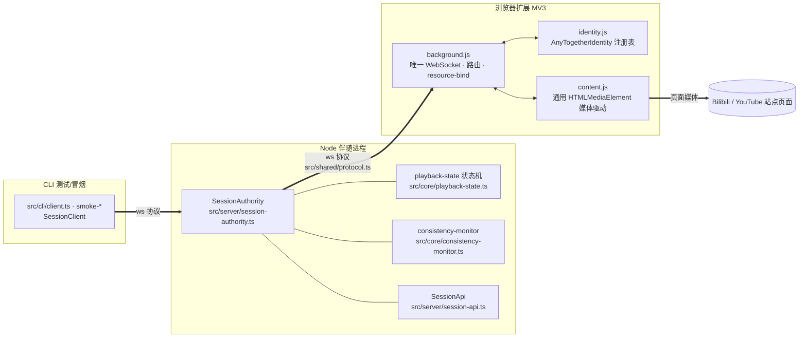
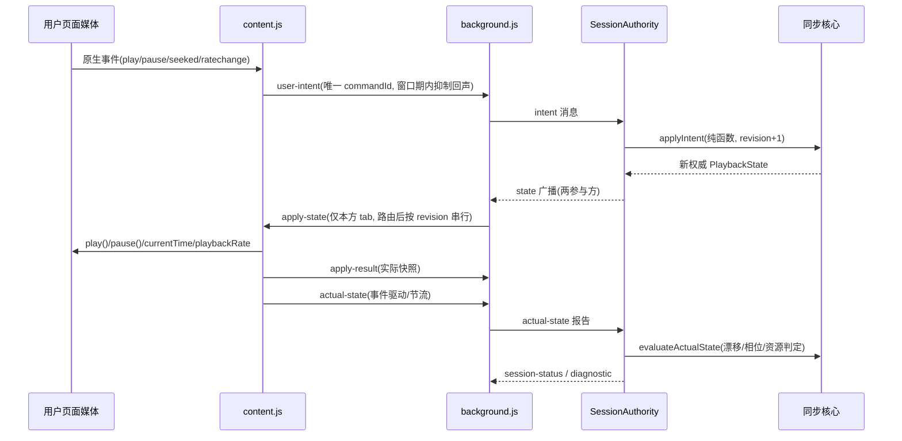

# AnyTogether 同步器设计总览

> 本文档描述当前源代码中的同步器架构与边界。配套文档：
> - [`authoring.md`](authoring.md) — 如何实现并注册一个新同步器（注册表、`ResourceAdapter` 契约、HTMLMediaElement 参考实现、测试与提交流程）。
> - [`protocol.md`](protocol.md) — WebSocket 线上协议、权威状态机、一致性判定与资源身份。
>
> 术语与源代码标识符完全一致（`src/adapters/*`、`src/shared/protocol.ts`、`extension/identity.js`）。
> 本文档不依赖 `docs/old_designs/`（旧架构已废弃）。

## 0. 标记约定

| 标记 | 含义 |
|---|---|
| `[当前实现]` | 当前源代码中已实现并测试的行为。 |
| `[建议约定]` | 给新同步器的推荐写法/规范，当前未被强制，但所有内置同步器都遵守。 |
| `[未来能力]` | 当前未实现，属于路线图；本文档描述其约束，绝不把未来能力写成已实现。 |

## 1. 同步核心 vs 同步器：职责边界

AnyTogether 的会话层（核心）与站点层（同步器）严格分离。核心**不知道任何站点**：它只处理
`ResourceIdentity`、`MediaPhase`、位置/速率/时长等共享语义；同步器**不接触会话状态**：
它不持有 sessionId、stateRevision、commandId 或命令序列，只把页面媒体映射到共享语义并报告真实情况。

| 层 | 拥有 | 绝不拥有 |
|---|---|---|
| 同步核心（Node 伴随进程：`src/core/playback-state.ts`、`src/core/consistency-monitor.ts`、`src/server/session-authority.ts`、`src/shared/protocol.ts`） | 会话与角色（host/client）、权威 `PlaybackState` 状态机（revision/sequence/相位/位置投影）、意图（intent）裁决、实际状态一致性判定、`session-status`/`diagnostic` 广播、资源绑定（`resource-bind`） | 任何站点 URL 规则、媒体元素定位、相位推导、播放控制；身份只做**结构校验**（`isValidResourceIdentity` 与站点无关） |
| 同步器（Node 侧：`src/adapters/*`；浏览器侧：`extension/identity.js` + 通用媒体驱动 `extension/content.js`） | 站点 URL 匹配策略（域名/URL 正则）、canonical 资源身份派生、目标媒体选择、原生状态 → `MediaPhase` 映射、权威目标状态施加、原生媒体事件上报/用户意图转述 | sessionId、stateRevision、lastCommandId、命令顺序、任何“权威”判定；适配器实例对会话与命令**无状态** |

## 2. 同步器存在的两个运行时面

同一个同步器契约在两个地方落地，二者语义一致、测试共享，但**代码不共享**：

1. **Node 侧规范契约**（`src/adapters/resource-adapter.ts` + `src/adapters/adapter-registry.ts`）：
   `ResourceAdapter` 接口 + `SyncerRegistration` 注册表。这是同步器语义的**规范定义与可测试参考**
   （`tests/adapters/bilibili-adapter.test.ts`、`tests/integration/dynamic-resource.test.ts`）。
   `[当前实现]` 注册表已泛化（`AdapterPage` 只含 `location.href` + 可选 `document`），
   但目前**没有生产级 Node 页面宿主**：CLI 无媒体播放器（冒烟脚本将权威状态回声为 `applied` 报告），
   注册表与适配器仅由测试实例化。`[未来能力]` Node 页面宿主（如桌面端嵌入播放器）。
2. **浏览器侧**（`extension/identity.js` 全局注册表 `AnyTogetherIdentity` + 通用媒体驱动
   `extension/content.js` + `extension/background.js`）：站点 URL 匹配、canonical 身份派生、能力声明
   全部集中在 identity.js；content.js 是**与站点无关的 HTMLMediaElement 驱动**（目标选择、相位映射、
   施加权威状态、事件转述/上报），background.js 只做桥接与路由，**content/background 均不实现域名逻辑**。

两条规则保证边界不腐化：
- `[当前实现]` 新增一个 HTMLMediaElement 站点 = identity.js 注册一项 + manifest 增加 `content_scripts.matches`/`host_permissions`；content.js、background.js 零改动。
- `[当前实现]` Node 侧 `AdapterRegistry` 的域名/URL 规则与 identity.js 的匹配规则**逐条同构**（长域名优先、规则匹配全 URL、拒绝 g/y 标志），二者必须保持同步。

## 3. 端到端数据流

要点（`[当前实现]`，详见 protocol.md）：
- 用户原生操作由 content.js 转述为语义 intent，**权威裁决永远在服务端**；页面永不自我判定。
- 每次 `applyIntent` 使 `stateRevision`/`lastSequence` 各 +1；`state` 广播推动两端施加。
- content.js 只接受**严格更新**的权威状态（revision 守卫），且与当前页面资源不匹配时拒绝执行（身份守卫）。
- 实际状态报告在**当前 revision** 上做一致性判定；`session-status.ready` 要求双方均已上报且无阻断问题。

## 4. 术语表

| 术语 | 定义（与源代码一致） |
|---|---|
| `adapterId` | 同步器稳定标识；同时是资源身份的名字空间（`ResourceIdentity.adapterId`）。当前内置值：`'bilibili'`、`'youtube'`。 |
| `ResourceIdentity` | `{ adapterId, canonicalUrl, resourceId? }`；canonicalUrl = origin + 去尾斜杠 pathname，去 query/hash。 |
| `canonicalUrl` | 同一资源映射到唯一身份的比较键；同一资源的所有 URL 形式归一为同一个值。 |
| `resourceId` | 可选站点内稳定资源键（如 Bilibili 的 BV 号、YouTube 的视频 id）；没有则不出现该字段。 |
| `MediaPhase` | `'loading' \| 'ready' \| 'playing' \| 'paused' \| 'seeking' \| 'buffering' \| 'ended' \| 'error'`。 |
| `PlaybackState` | 权威会话状态（sessionId、identity(可空)、revision、sequence、phase、位置锚点、速率、时长、lastCommandId、updatedAtMs、errorCode?）。 |
| `LocalPlaybackState` | 页面媒体**真实观测**快照（identity、phase、位置、速率、时长），绝不按上次命令合成。 |
| `AdapterTargetState` | 权威方要求施加的 `{ mediaPhase, positionSeconds, playbackRate }` 子集。 |
| `AdapterApplyResult` | `{ result: 'applied'\|'rejected'\|'unsupported', error?, state }`，state 恒为执行后的真实快照。 |
| `AdapterEvent` | `'play'\|'pause'\|'seeking'\|'seeked'\|'waiting'\|'playing'\|'ended'\|'error'\|'ratechange'\|'timeupdate'`（10 个原生媒体事件）。 |
| `AdapterCapability` | `'play'\|'pause'\|'seek'\|'set-rate'\|'replay'\|'native-events'`，注册时静态声明。 |
| `SyncerRegistration` | 注册表条目：`{ adapterId, name?, domain, urlRule?, create(page), capabilities }`。 |
| `AdapterSiteError` | 页面级显式失败（`code: 'invalid-url'\|'not-bilibili'\|'browser-required'\|'no-media'`），由 identify/select/read 抛出。 |
| `AdapterRegistryError` | 注册期失败（`'duplicate-adapter'\|'duplicate-domain'\|'invalid-registration'\|'invalid-rule'`），resolve 永不抛。 |
| 参与者 / host / client | 会话最多 2 人：先加入者为 host（创建者/权威审批者），后加入者为 client；`roleHint` 仅建议，最终由权威裁决。 |
| `stateRevision` / `lastSequence` | 每次成功施加意图或资源绑定各 +1，严格单调；`lastCommandId` 记录已应用命令用于幂等。 |
| 投影（projection） | `'playing'` 相位下按 `positionSeconds + (now − positionAtMs)/1000 × playbackRate` 外推当前位置；其他相位冻结锚点。 |
| 绑定（bind） | `resource-bind` 把会话绑定到某 `ResourceIdentity`；绑定前会话无资源（identity 为 null），播放意图被拒（`resource-unbound`）。 |

## 5. 当前范围与诚实边界

- `[当前实现]` 内置同步器有 **Bilibili**（`/video`、`/video/...` 页面）与 **YouTube**（`/watch` 且 query 含非空 `v=` 参数）两个；浏览器 manifest 只注入这两类资源页。
- `[当前实现]` 同步语义仅覆盖**单一媒体的相位/位置/速率/时长**；不包含滚动、PDF、播放列表等非媒体标量。
  `[未来能力]` 多资源/非媒体标量需要新的身份与状态扩展，当前协议与一致性判定均为“单资源、媒体相位”设计。
- `[当前实现]` 仓库内验证手段是 Node 单元/集成测试（`npm test`，当前 133/133 通过）与冒烟脚本（`npm run smoke:process` / `smoke:lan`）、扩展静态检查。
  Node 侧注册表与两个适配器的语义由测试验证；浏览器侧（identity.js 注册、manifest 注入范围、content.js 驱动）只经过扩展静态检查与 Node 侧同构规则测试。
- **真实浏览器验证边界**：真实 Chrome（macOS/Windows）实机与跨设备同步验证**尚未执行**（含 YouTube），本文档不宣称任何实机验证结果；
  真实浏览器验证属于提交流程的一部分（见 authoring.md §8），提交时须注明实际测过的平台，未测平台不得宣称。
- `[未来能力]` 状态持久化/恢复：核心已提供 `restorePlaybackState`（重锚 positionAtMs，保留 revision），
  但当前服务端不落盘；断线重连按广播状态自愈。

## 6. 文件地图

| 文件 | 职责 |
|---|---|
| `src/adapters/resource-adapter.ts` | `ResourceAdapter` 接口、`LocalPlaybackState`/`AdapterTargetState`/`AdapterApplyResult`/`AdapterEvent`/`AdapterCapability`/`AdapterSiteError`。 |
| `src/adapters/adapter-registry.ts` | `AdapterRegistry`、`SyncerRegistration`、`AdapterPage`、`AdapterUrlRule`、`AdapterRegistryError`、`defaultAdapterRegistry`。 |
| `src/adapters/bilibili-adapter.ts` | Bilibili 参考实现（`BilibiliAdapter` + `bilibiliRegistration`）。 |
| `src/adapters/youtube-adapter.ts` | YouTube 参考实现（`YoutubeAdapter` + `youtubeRegistration`；canonical 身份在适配器内由视频 id 重建）。 |
| `src/shared/resource.ts` | `createBilibiliResourceIdentity`（canonical 化）、`ResourceIdentityError`；共享站点守卫（仅 Bilibili；YouTube 的身份派生在适配器内，无独立构造器）。 |
| `src/shared/protocol.ts` | 线上与领域契约：身份/相位/意图/报告/消息类型 + 纯函数守卫（含 Bilibili 站点守卫；全部 JSON 可序列化）。 |
| `src/core/playback-state.ts` | 权威状态机：`createInitialPlaybackState`/`applyIntent`/`projectPlaybackPosition`/`restorePlaybackState`。 |
| `src/core/consistency-monitor.ts` | `evaluateActualState`：报告 vs 权威的一致性判定、阻断种类、阈值。 |
| `src/server/session-authority.ts` | WebSocket 服务端：加入/审批/绑定/意图/报告裁决与广播。 |
| `src/client/session-client.ts` | 客户端（CLI/测试/未来宿主）封装：连接、意图、报告、状态监听。 |
| `extension/identity.js` | 浏览器侧 `AnyTogetherIdentity` 注册表（URL 匹配、身份派生、能力列表）。 |
| `extension/content.js` | 通用 HTMLMediaElement 媒体驱动（与站点无关）。 |
| `extension/background.js` | 唯一 WebSocket、路由、tab 接管、资源切换、恢复。 |
| `tests/adapters/bilibili-adapter.test.ts` | Bilibili 适配器单元测试（fake page 注入）。 |
| `tests/adapters/youtube-adapter.test.ts` | YouTube 适配器单元测试（fake page 注入）+ 默认注册表双站点路由断言。 |
| `tests/integration/dynamic-resource.test.ts` | 注册表 + 权威 + 绑定/切换端到端集成测试。 |
